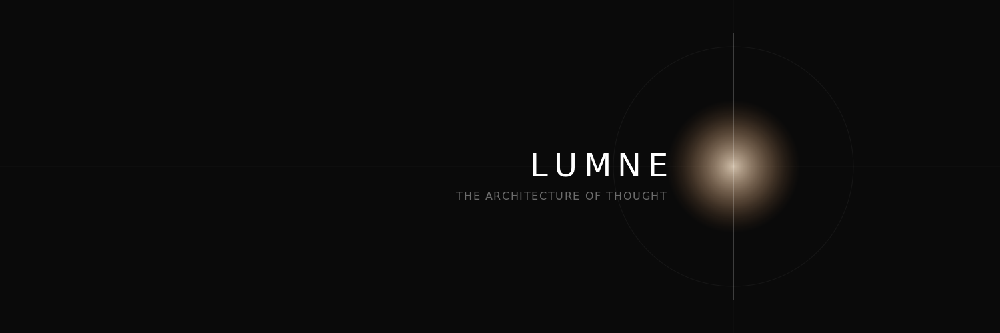
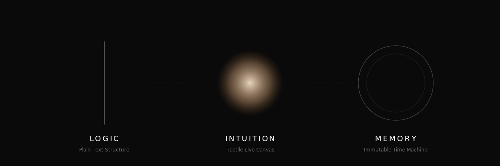

# LUMNE — The Architecture of Thought

### A studio for human thought.

This repository is the public showcase for LUMNE. It publishes the outward
page, brand assets, and selected product stills. It is not an open source
release of the Lumne product.

LUMNE is a studio for human thought.
Today, that studio begins with slide authoring.
It brings together the **logic** of structured text, the **intuition** of a tactile canvas, and the **memory** of a living Time Capsule.

---

## The Name

LUMNE is named from **Lumen**, the Latin word for light, and the product's three pillars: **Logic**, **Intuition**, and **Memory**.
It reflects our belief that unfinished thoughts should be illuminated by structure, shaped through touch and instinct, and preserved safely as a living memory.

---

## 📽️ The Vision
Traditional presentation tools cost people time. AI generators can cost them control.
**LUMNE keeps people in charge.**

Start with the story in pure **Plain Text**, sculpt your visuals on a fluid canvas, and never fear a mistake with our integrated **Time Capsule**. AI supports structure, iteration, and refinement while the author stays in command.
LUMNE works without requiring an AI API. AI can accelerate the work when you choose to use it, but the authoring loop belongs to you.

---

## Why LUMNE Exists

We are living through a moment where more and more work is produced by outsourcing thought to AI and accepting output with no human judgment behind it.
LUMNE was built in response to that pattern.

LUMNE is not against AI. It is against surrendering thought.
People should stay in charge of what they mean, what they make, and what they stand behind. AI should help structure, compare, refine, and explore, but it should not replace the act of thinking.

---

## ✨ The Three Pillars

### 1. Pure Logic (Story-First)
Logic is the skeleton of persuasion. Draft your outline in **Plain Text**. No boxes to drag, no fonts to fix—just your reasoning, organized and powerful. Focus on *what* you want to say, and let LUMNE handle the rest.

### 2. Tactile Intuition (The Living Canvas)
Intuition is the soul of design. Elements on your slide respond to your touch. Move a block, and the layout breathes around it. It’s direct manipulation, guided by a silent AI that understands the geometry of beauty.

### 3. Infinite Safety (Time Capsule)
Memory is the foundation of creativity. Every moment is preserved in a secure, local-first **Time Capsule**. Travel back to an earlier direction, explore alternative paths, and branch your ideas without ever fearing a "wrong" move.

---

## 🛠️ Crafted for Your Desktop
LUMNE is currently under heavy development. We are perfecting the magic to ensure it's as stable as it is beautiful.

- **Private by Design**: Your thoughts and data stay on your machine.
- **Keep People In Charge**: The core studio works without AI, and Gemini can act as a silent partner for structure, iteration, and refinement when you choose to use it.
- **Seamless Harmony**: The transition between your words and your visuals stays fluid and immediate.

---

## 📬 Follow Lumne
Lumne is opening in public through selected screenshots, notes, and product
updates.

- **Twitter/X**: [@LumneApp](https://x.com/LumneApp)
- **GitHub**: [project-lumne](https://github.com/ryo0221/project-lumne)

## Legal and Usage

- Copyright © 2026 LUMNE Team. All rights reserved.
- This repository is provided as a public showcase only.
- No license is granted to copy, modify, redistribute, or create derivative
  works from the code, copy, screenshots, icons, logos, or other assets in
  this repository without prior written permission.
- For press, research reference, partnership, or commercial discussions,
  contact [@LumneApp](https://x.com/LumneApp).

*"Simplicity is the ultimate sophistication."* — LUMNE

---
© 2026 LUMNE Team. All rights reserved.
